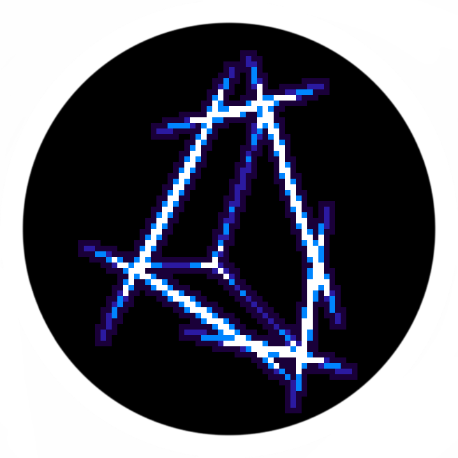

<h1 align="center">附魔逸响 </h1>

你好呀！欢迎使用 <b>附魔逸响</b>(WhooshWhoosh) 模组，他提供了更多有趣的附魔，帮助我们战斗和建造。

目前模组仍在开发阶段，敬请期待！

<table align="center" border="0" cellspacing="0">
  <tr>
    <td align="center">
      
目前模组已添加以下附魔：

        <table align="center" border="0" cellspacing="0" cellpadding="10">
          <tr>
            <td align="center"><b>神化</b></td>
            <td align="center">将物品上的所有附魔升至满级</td>
          </tr>
        </table>
    </td>
  </tr>
</table>

<a href="https://github.com/Go-2025/WhooshWhoosh">GitHub</a> | <a href="https://github.com/Go-2025/WhooshWhoosh/issues">Issues</a> | <a href="https://github.com/Go-2025/WhooshWhoosh/blob/main/LICENSE">License</a>

<small style="color:#999">想要联系开发者？请发送邮件至 <a href="mailto:36851252@qq.com">邮箱</a></small>